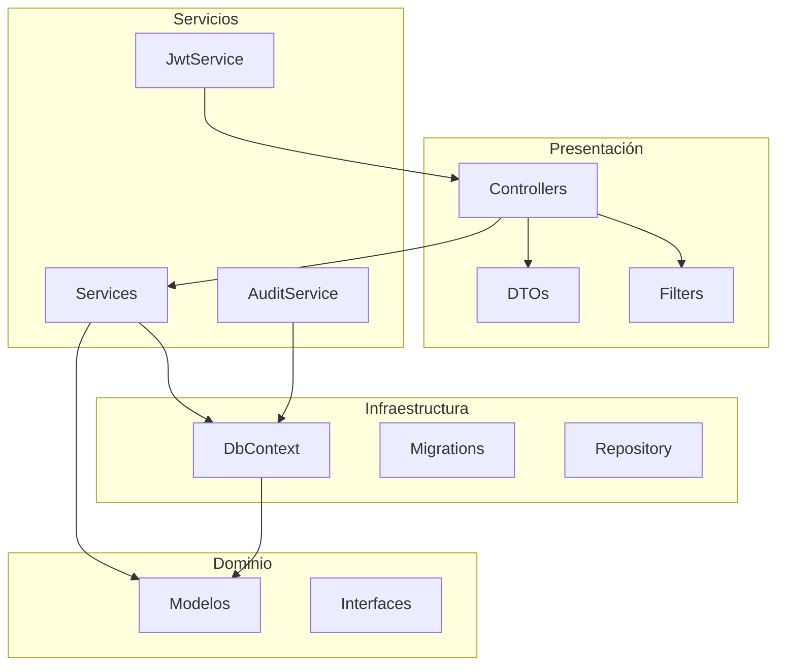
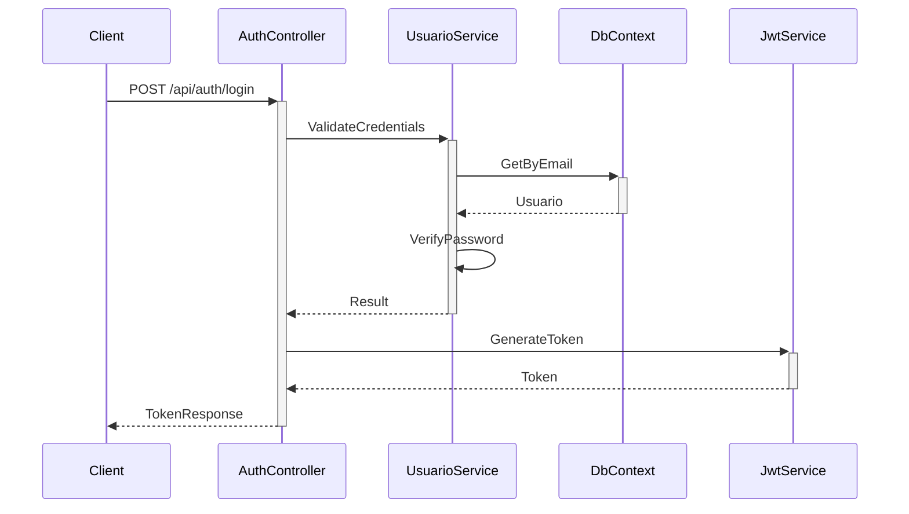
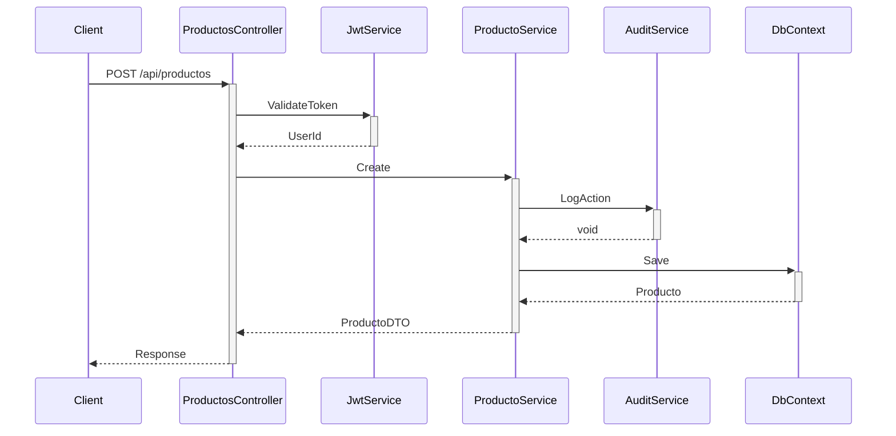
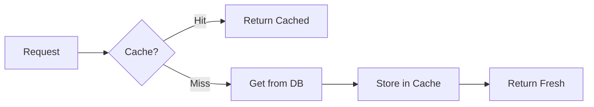

# Arquitectura del Sistema

## Visión General

La aplicación sigue una arquitectura en capas con principios Clean Architecture, separando claramente las responsabilidades y manteniendo un bajo acoplamiento entre componentes.



## Capas de la Aplicación

### 1. Capa de Presentación (API)

#### Controllers
- Manejo de requests HTTP
- Validación básica de input
- Transformación DTO ↔ Modelo
- Gestión de respuestas HTTP

#### DTOs (Data Transfer Objects)
- Contratos de API
- Validación de datos
- Mapeo de modelos

#### Filters
- Manejo global de excepciones
- Autorización JWT
- Logging de requests
- Rate limiting

### 2. Capa de Servicios

#### ProductoService
```csharp
public interface IProductoService
{
    Task<ProductoDTO> GetByIdAsync(int id);
    Task<PagedResult<ProductoDTO>> GetAllAsync(ProductoQueryParams queryParams);
    Task<ProductoDTO> CreateAsync(CreateProductoDTO dto, int userId);
    Task<ProductoDTO> UpdateAsync(int id, UpdateProductoDTO dto, int userId);
    Task DeleteAsync(int id, int userId);
}
```

#### UsuarioService
```csharp
public interface IUsuarioService
{
    Task<UsuarioDTO> GetByIdAsync(int id);
    Task<UsuarioDTO> GetByEmailAsync(string email);
    Task<UsuarioDTO> CreateAsync(CreateUsuarioDTO dto);
    Task<bool> ValidateCredentialsAsync(string email, string password);
}
```

#### JwtService
```csharp
public interface IJwtService
{
    string GenerateToken(Usuario usuario);
    bool ValidateToken(string token);
    int? GetUserIdFromToken(string token);
}
```

### 3. Capa de Dominio

#### Modelos
- Entidades de negocio
- Reglas de validación
- Lógica de dominio

#### Value Objects
- Objetos inmutables
- Validación de valores
- Encapsulación de reglas

### 4. Capa de Infraestructura

#### DbContext
- Configuración de Entity Framework
- Mapeo de entidades
- Gestión de transacciones

#### Migrations
- Versionado de base de datos
- Scripts de migración
- Datos semilla

## Flujos de Datos Principales

### 1. Autenticación


### 2. Gestión de Productos


## Consideraciones de Seguridad

### 1. Autenticación
- Tokens JWT con tiempo de expiración
- Refresh tokens para sesiones largas
- Almacenamiento seguro de contraseñas (BCrypt)

### 2. Autorización
- Basada en roles y claims
- Validación por endpoint
- Auditoría de acciones

### 3. Protección de Datos
- Encriptación en tránsito (HTTPS)
- Datos sensibles hasheados
- Validación de entrada

## Optimización y Rendimiento

### 1. Caché


### 2. Estrategias de Carga
- Lazy Loading para relaciones
- Eager Loading configurable
- Proyecciones específicas

### 3. Índices y Consultas
- Índices estratégicos
- Consultas optimizadas
- Monitoreo de performance

## Monitoreo y Logging

### 1. Logs Aplicativos
- Errores y excepciones
- Acciones de usuario
- Performance metrics

### 2. Auditoría
- Cambios en datos
- Accesos al sistema
- Acciones administrativas

### 3. Métricas
- Tiempo de respuesta
- Uso de recursos
- Errores por minuto