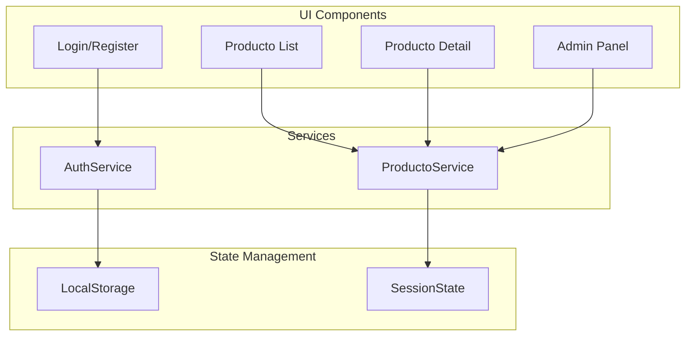

# Documentación del Frontend

## Estructura y Tecnologías

### Stack Tecnológico
- HTML5
- CSS3
- JavaScript (ES6+)
- Fetch API para comunicación con backend
- LocalStorage para gestión de token

## Arquitectura Frontend



## Componentes Principales

### 1. Autenticación (auth.js)
```javascript
// Manejo de autenticación
class AuthService {
    static async login(email, password)
    static async register(userData)
    static getToken()
    static logout()
    static isAuthenticated()
}
```

### 2. Gestión de Productos (productos.js)
```javascript
// Manejo de productos
class ProductoService {
    static async getAll(params)
    static async getById(id)
    static async create(producto)
    static async update(id, producto)
    static async delete(id)
}
```

### 3. UI Principal (main.js)
```javascript
// Gestión de UI y eventos
class UIManager {
    static initializeApp()
    static updateProductList()
    static handleFormSubmit()
    static showNotification()
}
```

## Estilos y Diseño Responsivo

### Grid System
- Layout basado en CSS Grid
- Breakpoints responsive:
  - Mobile: < 768px
  - Tablet: 768px - 1024px
  - Desktop: > 1024px

### Componentes UI
- Cards para productos
- Formularios estilizados
- Modales y overlays
- Notificaciones toast

## Seguridad Frontend

### 1. Token Management
```javascript
// Gestión segura de tokens
class TokenManager {
    static store(token) {
        localStorage.setItem('auth_token', token);
    }
    
    static get() {
        return localStorage.getItem('auth_token');
    }
    
    static remove() {
        localStorage.removeItem('auth_token');
    }
}
```

### 2. Interceptores HTTP
```javascript
// Interceptor para requests
const httpClient = {
    async fetch(url, options = {}) {
        const token = TokenManager.get();
        if (token) {
            options.headers = {
                ...options.headers,
                'Authorization': `Bearer ${token}`
            };
        }
        return fetch(url, options);
    }
};
```

## Manejo de Estados

### 1. Session State
- Token JWT
- Datos de usuario
- Permisos y roles

### 2. Application State
- Lista de productos
- Filtros activos
- Estado de UI

## Optimización y Performance

### 1. Lazy Loading
- Carga diferida de imágenes
- Importación dinámica de módulos
- Paginación de productos

### 2. Caché
- Caché de productos frecuentes
- Almacenamiento local de datos estáticos
- Gestión de expiración de caché

## Guía de Desarrollo Frontend

### 1. Convenciones de Código
- Nombres de archivos en camelCase
- Clases en PascalCase
- Constantes en UPPER_SNAKE_CASE

### 2. Estructura de Archivos
```
Frontend/
├── index.html
├── css/
│   ├── styles.css
│   ├── components/
│   └── layouts/
├── js/
│   ├── auth.js
│   ├── main.js
│   ├── productos.js
│   ├── services/
│   └── utils/
└── assets/
    └── images/
```

### 3. Buenas Prácticas
- Uso de async/await
- Manejo de errores consistente
- Validación de formularios
- Feedback visual al usuario

## Testing Frontend

### 1. Unit Testing
- Pruebas de servicios
- Validación de formularios
- Manipulación del DOM

### 2. Integration Testing
- Flujos de usuario completos
- Interacción con API
- Manejo de estados

### 3. E2E Testing
- Flujos críticos de negocio
- Escenarios de usuario reales
- Casos de error