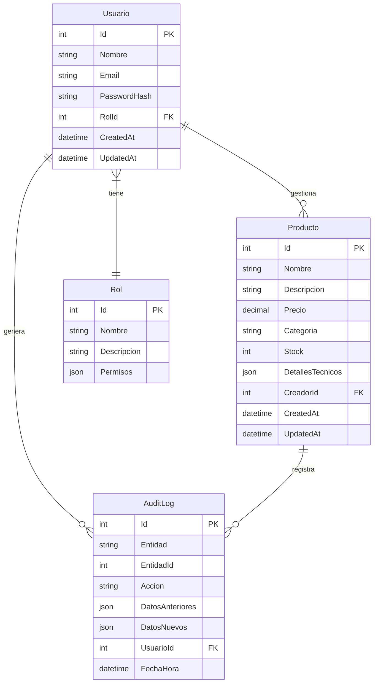

# Modelos del Sistema

## Diagrama de Relaciones


## Descripción Detallada de Modelos

### Usuario
Representa a los usuarios del sistema.

#### Propiedades
- **Id**: Identificador único
- **Nombre**: Nombre completo del usuario
- **Email**: Correo electrónico (único)
- **PasswordHash**: Hash de la contraseña (BCrypt)
- **RolId**: Referencia al rol del usuario
- **CreatedAt**: Fecha de creación
- **UpdatedAt**: Fecha de última actualización

#### Reglas de Negocio
- Email debe ser único
- Password debe cumplir requisitos de seguridad:
  - Mínimo 8 caracteres
  - Al menos una mayúscula
  - Al menos un número
  - Al menos un carácter especial

### Producto
Representa los productos gestionados en el sistema.

#### Propiedades
- **Id**: Identificador único
- **Nombre**: Nombre del producto
- **Descripcion**: Descripción detallada
- **Precio**: Precio unitario (decimal)
- **Categoria**: Categoría del producto
- **Stock**: Cantidad disponible
- **DetallesTecnicos**: JSON con especificaciones técnicas
- **CreadorId**: Usuario que creó el producto
- **CreatedAt**: Fecha de creación
- **UpdatedAt**: Fecha de última actualización

#### Reglas de Negocio
- Precio debe ser mayor a 0
- Stock debe ser >= 0
- Nombre debe ser único
- Categoría debe ser una de las predefinidas

### Rol
Define los roles y permisos en el sistema.

#### Propiedades
- **Id**: Identificador único
- **Nombre**: Nombre del rol
- **Descripcion**: Descripción del rol
- **Permisos**: JSON con permisos específicos

#### Roles Predefinidos
1. **Admin**
   - Acceso total al sistema
   - Gestión de usuarios
   - Gestión de productos
   - Visualización de logs

2. **Vendedor**
   - Lectura de productos
   - Modificación de productos
   - Visualización de inventario

3. **Usuario**
   - Lectura de productos
   - Visualización de catálogo

### AuditLog
Registro de auditoría para cambios en el sistema.

#### Propiedades
- **Id**: Identificador único
- **Entidad**: Nombre de la entidad (Usuario/Producto)
- **EntidadId**: ID del registro modificado
- **Accion**: Tipo de acción (Create/Update/Delete)
- **DatosAnteriores**: Estado anterior (JSON)
- **DatosNuevos**: Estado nuevo (JSON)
- **UsuarioId**: Usuario que realizó la acción
- **FechaHora**: Timestamp de la acción

## Validaciones y Constraints

### Usuario
```csharp
[Required, MaxLength(100)]
public string Nombre { get; set; }

[Required, EmailAddress, MaxLength(150)]
public string Email { get; set; }

[Required]
public string PasswordHash { get; set; }
```

### Producto
```csharp
[Required, MaxLength(100)]
public string Nombre { get; set; }

[MaxLength(500)]
public string Descripcion { get; set; }

[Required, Range(0.01, double.MaxValue)]
public decimal Precio { get; set; }

[Required, MaxLength(50)]
public string Categoria { get; set; }

[Range(0, int.MaxValue)]
public int Stock { get; set; }
```

## Índices de Base de Datos

### Usuario
- PK: Id
- UK: Email
- IX: RolId

### Producto
- PK: Id
- UK: Nombre
- IX: Categoria
- IX: CreadorId

### AuditLog
- PK: Id
- IX: EntidadId, Entidad
- IX: UsuarioId
- IX: FechaHora

## Consideraciones de Rendimiento

1. **Índices Compuestos**
   - (Categoria, Nombre) para búsquedas filtradas
   - (FechaHora, Entidad) para consultas de auditoría

2. **Paginación**
   - Implementada en todas las consultas de lista
   - Tamaño de página configurable
   - Ordenamiento dinámico

3. **Caching**
   - Cache de productos frecuentes
   - Cache de datos de usuario
   - Invalidación selectiva

4. **Optimización de Consultas**
   - Eager loading para relaciones
   - Proyecciones para DTOs
   - Consultas asíncronas